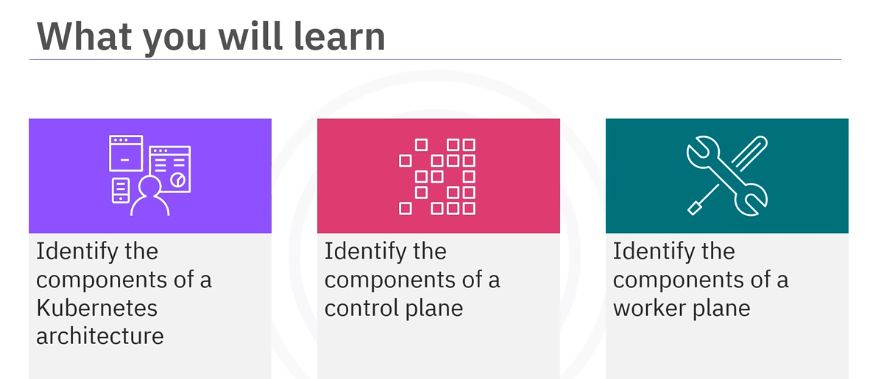
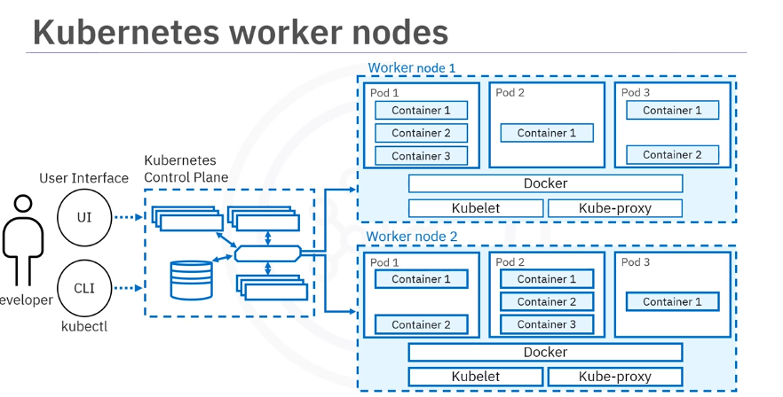
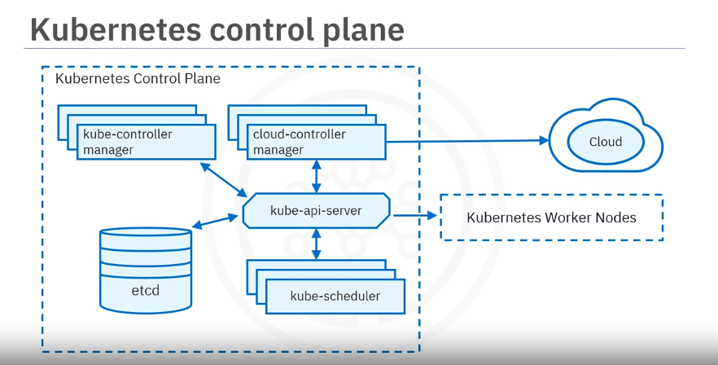
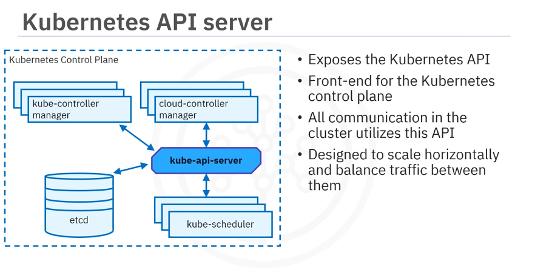
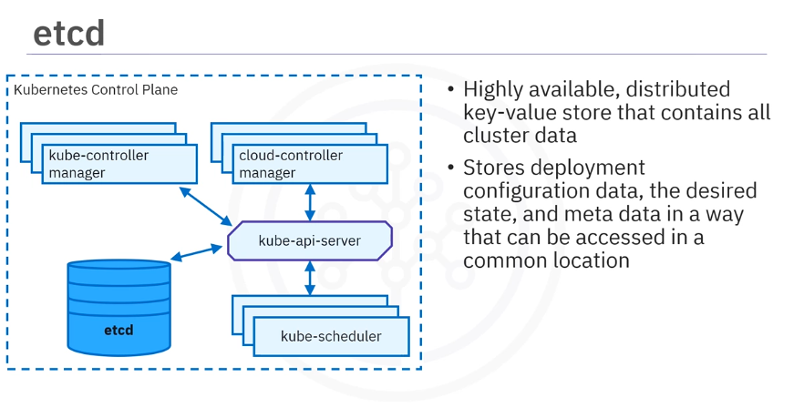
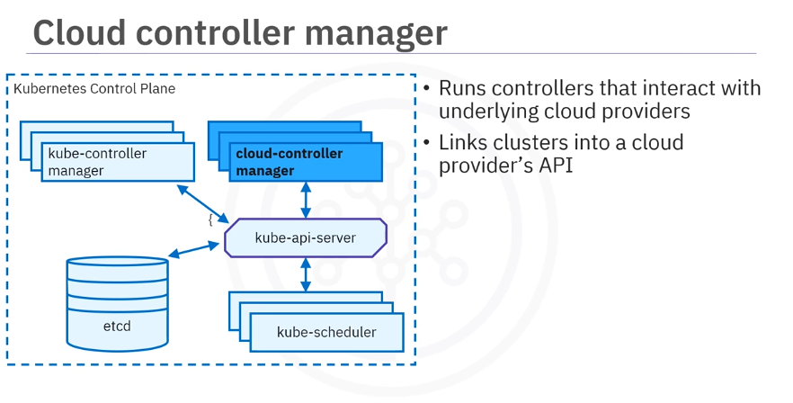
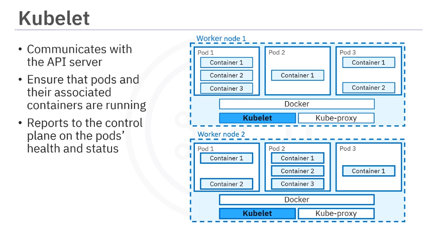
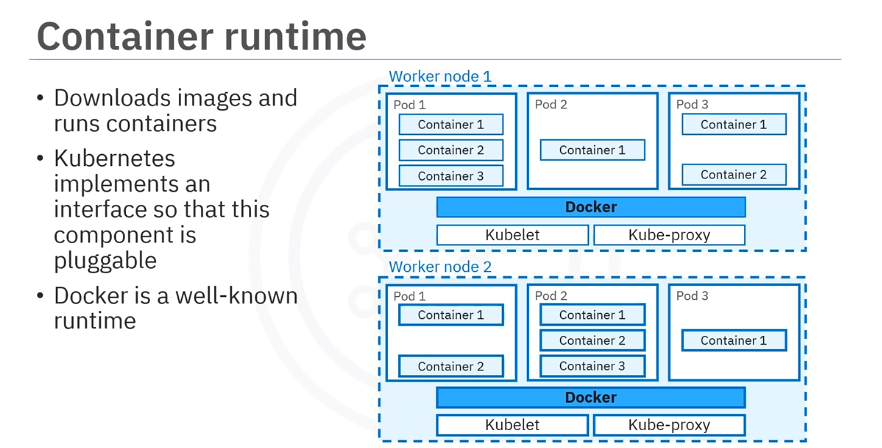

# Module 2 - Section# Module 2 - Section 3: Video - Kubernetes Architecture

## Table of Contents

- [Introduction](#introduction)
- [KubernetesControl Plane](#kubernetes-control-plane)
- [Nodes](#nodes)
- [Summary](#summary)

## Introduction

Welcome to Kubernetes architecture. After watching this video, you will be able to describe the control plane, worker nodes, and key components of Kubernetes architecture.

## Kubernetes Control Plane

A deployment of Kubernetes is called a Kubernetes cluster. A Kubernetes cluster is a cluster of nodes that runs containerized applications.

Each cluster has one master node, the Kubernetes control plane, and one or more worker nodes.

Nodes are worker machines in a Kubernetes cluster. In other words, user applications are run on nodes. Nodes are not created by Kubernetes itself, but rather by the cloud provider.

This allows Kubernetes to run on a variety of infrastructures. The nodes are then managed by the control plane.

The control plane makes global decisions about the Kubernetes cluster.

It is responsible for maintaining the desired/intended state of the cluster by making decisions and detecting and responding to events in the cluster, such as which applications are running and their container images.

As an analogy, it is similar to a thermostat. You specify the desired temperature, and the thermostat regulates heating and cooling systems continuously to achieve the specified state.

An example of decision made by the control plane is the scheduling of workloads, and an example of responding to an event is creating new resources when an application is deployed. 

The control plane components include:

- **Kubernetes API Server**:
  - Exposes the Kubernetes APIs.
  - Frontend for the Kubernetes control plane.
  - All communications in the cluster utilize this API.
  - For example, the Kubernetes API server accepts commands to view or change the state of the cluster.
  - The main implementation of a Kubernetes API server is Kube-api-server, which is designed to scale horizontally by deploying more instances. You can run several instances of kube-api-server and balance traffic between those instances.

- **etcd**:
  - A consistent and highly-available distributed key-value store used as Kubernetes' backing store for all cluster data.
  - Store deployment configuration data, then desired state, and metadata in  a way that can be accessed in a common locations.
      - When you tell Kubernetes to deploy your application, that deployment configuration is stored in etcd.
      - Etcd defines the state in a Kubernetes cluster, and the system works to bring the actual state to match the desired state.

- **Scheduler**: Watches for newly created pods with no assigned node and selects a node for them to run on.
  - The Kubernetes scheduler assigns newly created pods to nodes: This basically means that the kube scheduler determines where your workloads should run within the cluster.
  - The scheduler selects the most optimal node according to Kubernetes scheduling principles, configuration options, and available resources.

- **Controller Manager**: Runs controller processes to regulate the state of the cluster.
  - The Kubernetes controller manager runs all the controller processes that monitor the state of the cluster.
  - Ensure, make changes to bring the actual state to the desired state.

- **Cloud controller manager**:
  - The cloud controller manager runs controller processes that interact with the underlying cloud providers.
  - These controller effectively link cluster into a cloud provider's API. Since Kubernetes is open source and would ideally be adopted by a variety of cloud providers and organizations.
  - Kubernetes strive to be as cloud agnostic as possible. The cloud controller manager allows both Kubernetes and the cloud providers to evolve freely without introducing dependencies on the other.
  - For example, the cloud controller manager can create a load balancer in the cloud provider when you create a service of type LoadBalancer.

## Nodes

Nodes
- Are the worker machines in a Kubernetes cluster, in other words, user applications are run on nodes
- Can be virtual or physical machines.
- Each node is managed by the control plane.
- Contains the services necessary to run applications.
- Nodes includes **Pods** which are the smallest deployable units/entity in Kubernetes.
  - Pods include one or more containers.
  - Containers share all the resources of the node and can communicate among themselves.

The key components of a worker node include:

- **Kubelet**: the most important component of a worker node.
  - It communicates with the API server to receive new and modified pod specifications
  - Ensures that the pods and their associated containers are running as desired.
  - Reports the status of the node and the pods running on the node to the control plane.
  - In order to start a pod, the kubelet uses the container's runtime

- **Container Runtime**:
  - Responsible for downloading images and running containers.
  - Kubernetes implements an interface so that this component is pluggable: a container runtime interface that permits pluggability of the container runtime.
  - Docker is a well-known container runtime, Podman and Creo are two other commonly used as container runtimes.

- **Kube-proxy**:
  - A network proxy that runs on each node in a cluster
  - Maintains network rules and allows communication to pods from inside or outside the cluster: in other words, communication to workloads running on the cluster

## Summary

In this section, you learned that the control plane makes global decisions about the Kubernetes cluster and is made up of controllers, an API server, a scheduler, and etcd. Worker nodes run important Kubernetes components as well as user workloads deployed on the cluster. The smallest deployable entity in Kubernetes is a pod, which includes one or more containers.

- A control plane makes global decisions about the Kubernetes cluster
- A control plane is made up of controllers, an API server, a scheduler, and an etcd
- A worker plane is made up of nodes, kubelet, container runtime, and kube- proxy
- Worker nodes run important Kubernetes components as well as user workloads deployed on the cluster
- The smallest deployable entity in Kubernetes is a pod that includes one or more containers

