# Module 2 - Section# Module 2 - Section 4: Video - Kubernetes Objects Part 1

## Table of Contents

- [Introduction](#introduction)
- [Defining Kubernetes Objects](#defining-kubernetes-objects)
  - [Basic Kubernetes Objects](#basic-kubernetes-objects)
    - [Labels and Selectors](#labels-and-selectors)
    - [Namespaces](#namespaces)
    - [Pods](#pods)
    - [Replica Sets](#replica-sets)
    - [Deployments](#deployments)

## Introduction

Welcome to Kubernetes Objects Part 1. After this section, you will be able to define a Kubernetes object and its properties, describe basic Kubernetes objects and their features, and demonstrate how Kubernetes objects relate to each other.

## Defining Kubernetes Objects

In the real world, an object is something that has an identity, a state, and a behavior. A window or a shopping cart are examples of objects. 

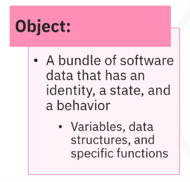

A software object is a bundle of data that has an identity, a state, and a behavior. Examples include variables, data structures, and specific functions.

Another term is entity, which also has an identity and associated data. For example, in banking, a customer account is an entity.

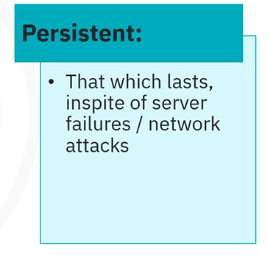

Finally, the term persistent means something will last even if there is a server failure or network attack. An example is persistent storage. 

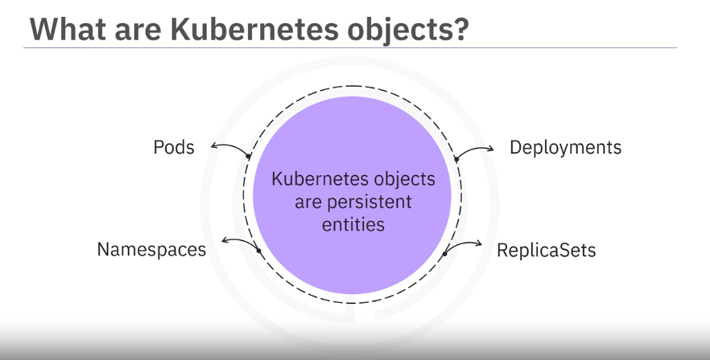

Kubernetes objects are persistent entities. Examples include pods, namespaces, replica sets, deployments, and more.

## Basic Kubernetes Objects

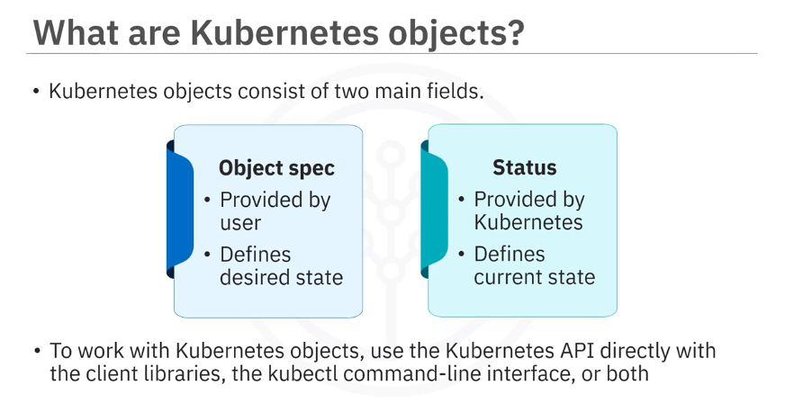

Kubernetes objects consist of two main fields: object spec and status.

- The object spec is
  - Provided by the user
  - Which dictates an object's desired state.
- Status is
  - Provided by Kubernetes
  - This describes the current state of the object.
 
Kubernetes works towards matching the current state to the desired state. To work with these objects, use the Kubernetes API directly with the client libraries and the kubectl command-line interface or both.

### Labels and Selectors

- Labels are key-value pairs attached to objects.
  - They are intended for identification of objects.
  - However, a label does not uniquely identify a single object.
  - Many objects can have the same labels, and this helps to organize and group objects.
- Label selectors are the core grouping method in Kubernetes.
  - They allow you to identify a set of objects.

### Namespaces and names

- Namespaces provide a mechanism for isolating groups of resources within a single cluster.
  - Segregate cluster by team, project, ect: this is useful when teams share a cluster for cost-saving purposes or for maintaining multiple projects in isolation.
- Necessary with larger numbers of users:
  - Namespaces are ideal when the number of cluster users is large.
  - Examples of namespaces are kube system, intended for system users, and the default namespace used to hold user's applications.
- There are different patterns of working with namespaces.
  - There may be only one namespace for a user who works with one team, which only has one project that is deployed into a cluster.
    - 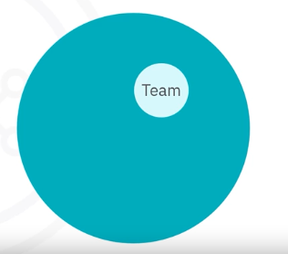
  - Alternatively, there may be many teams or projects or a lot of users with different needs, where additional namespaces may be created.
    - 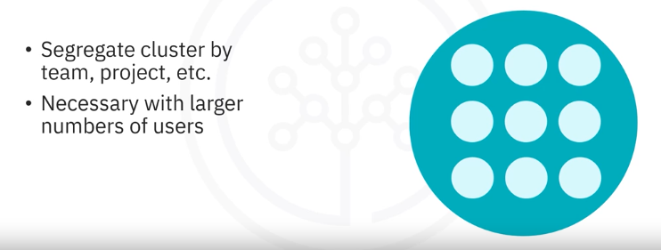

- Namespaces provide a scope for the names of objects: each object must have a unique name for that resource type within that namespace.
- 

### Pods

- 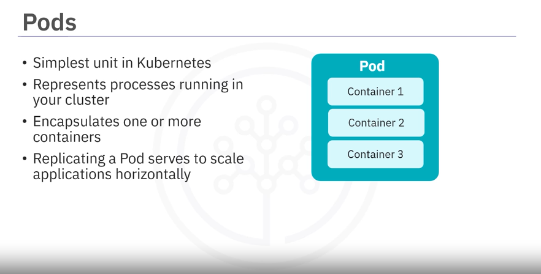

- A pod is the simplest unit in Kubernetes.
- A pod represents a process or a single instance of an application running in the cluster.
- A pod usually wraps one or more containers,
- Creating replicas of a pod serves to scale an application horizontally. 
- YAML files are often used to define the object that you want to create.
  - The YAML file shown defines a simple pod:
    - 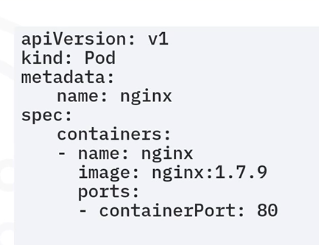
  - The `kind` field specifies the kind of object to be created. In this case, we create a pod.
  - The `spec` field provides the appropriate fields for the object to be created such as the containers that will run in this pod. 
    - A pod `spec` must contain at least one container. In this example, the container is named nginx.
    - The `image` field dictates which image will run in the pod 
    - `ports` array lists the ports that the container exposes.

### Replica Sets

- A replica set is a set of identical running replicas of a pod that are horizontally scaled.
- 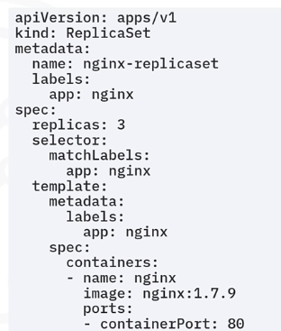
- The configuration files for a replica set and a pod are different from each other.
  - The `kind` field specifies the kind of object to be created. In this case, we create a `replicaSet`.
  - The `replicas` field specifies:
    - Number of replicas that should be running at any given time:
      - whenever this field is updated, the replica set creates or deletes pods to meet the desired number of replicas. 
  - `template`: pod template
    - 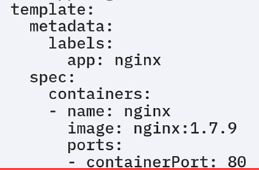
    - A pod template is included in the replica set spec, which defines the pods that should be created by the replica set.
  - `selector` field:
    - 
    - The labels supplied in the `matchLabels` field specify the pods that can be acquired by the replica set.
    - Notice that the label identified in the `matchLabels` field is the same as the `labels` field in the pod `template`.
      - Both are the `app: nginx`
      - 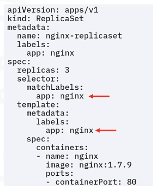
-  Creating replica sets directly is not recommended. Instead, create a deployment, which is a higher-level concept that manages replica sets and offers more features and better control.

### Deployments

A deployment is a higher-level object that provides updates for both pods and replica sets.

- Deployments run multiple replicas of an application using replica sets and offer additional management capabilities on top of these replica sets.
- Deployments are suitable for stateless applications. For stateful applications, stateful sets are used.
- Examples of deployments include the deployment of a replicated application, pod updates managed by a deployment, or the scaling up of an application.
  - 
  - This `deployment` specification example shows:
    - the `kind` is `Deployment`
    - which defines the number of `replicas`
    - a `selector` to identify which pods can be acquired
    - and a pod `template`.
- Update triggers a rollouts:
  - One key feature provided by deployments but not replica sets is **rolling updates**.
    - A rolling update scales up a new version to the appropriate number of replicas
    - and scales down the old version to zero replicas.
    - The replica set ensures that the appropriate number of pods exist, while the deployment orchestrates the rollout of a new version.

## Summary

In this section, you learned that Kubernetes objects are persistent entities. Their main fields are object spec and status. Namespaces help in isolating groups of resources within a single cluster and pods represent a process or an instance of an app running in the cluster. Replica sets create and manage horizontally scaled running pods and deployments provide updates for pods and replica sets.

- Kubernetes objects are persistent entities; their main fields are “Object spec" and “Status”
- Namespaces help in isolating groups of resources within a single cluster
- Pods represent a process or an instance of an app running in a cluster
- ReplicaSets create and manage horizontally scaled running Pods
- Deployments provide updates for Pods and ReplicaSets

