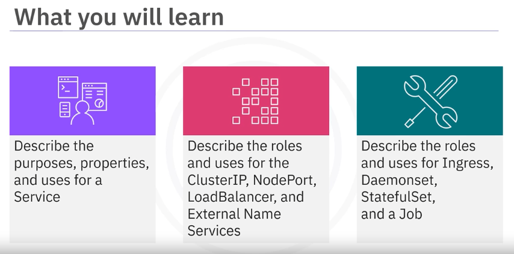

# Module 2 - Section 5: Video - Kubernetes Objects Part 2

## Table of Contents

- [Module 2 - Section 5: Video - Kubernetes Objects Part 2](#module-2---section-5-video---kubernetes-objects-part-2)
  - [Introduction](#introduction)
  - [StatefulSet](#statefulset)
  - [Job](#job)
  - [Service](#service)
  - [Cluster IP](#cluster-ip)
  - [NodePort Service](#nodeport-service)
  - [External Load Balancer](#external-load-balancer)
  - [Ingress](#ingress)
  - [DaemonSet](#daemonset)
  - [External Name](#external-name)

## Introduction

In this video, you will learn about various Kubernetes objects and their functionalities.

## StatefulSet

A StatefulSet manages deployment and scaling of Pods, and provides guarantees about the ordering and uniqueness of Pods. 

It maintains a sticky identity for each Pod request and provides persistent storage volumes for your workloads.

## Job

A Job creates Pods and tracks the Pod completion process. 

Jobs are retried until completed. Deleting a Job will remove the created Pods. 

Suspending a Job will delete its active Pods until the Job resumes. 

A Job can run several Pods in parallel, and CronJobs are regularly used to create Jobs on an iterative schedule.

## Service

A service in Kubernetes:

- Is a REST object , like Pods.
- Is a logical abstraction that represents a set of Pods in a cluster.
- Provides policies that define how to access the associated Pods and cluster.
- Acts as a load balancer across the Pods.
- Is assigned a unique IP address for accessing applications deployed on Pods.
- Eliminates the need for a separate service discovery process/mechanism.
 
[More about Kubernetes Service](05_01_kubernetes-service.md)

## Cluster IP

Cluster IP is the default and most common service type and provides inter-service communication within the cluster.

## NodePort Service

An extension of Cluster IP Service, a NodePort Service creates and routes the incoming requests automatically to the Cluster IP Service.

## External Load Balancer

An extension of the NodePort Service, an External Load Balancer creates NodePort and Cluster IP Services automatically.

## Ingress

An Ingress is an API object that, when combined with a controller, provides routing rules to manage external users' access to multiple services in a Kubernetes cluster.

## DaemonSet

Using a DaemonSet ensures that there is at least one instance of the Pod on all your nodes.

## External Name

You can use External Name to create a Service that represents external storage and enables Pods from different namespaces to talk to each other.
