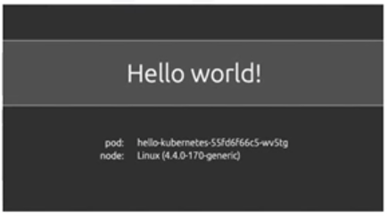
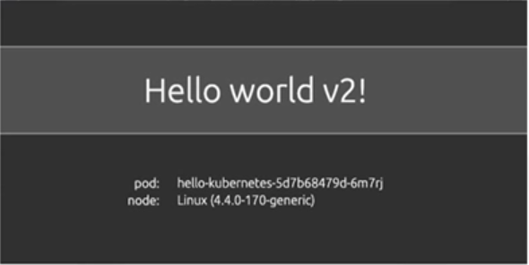
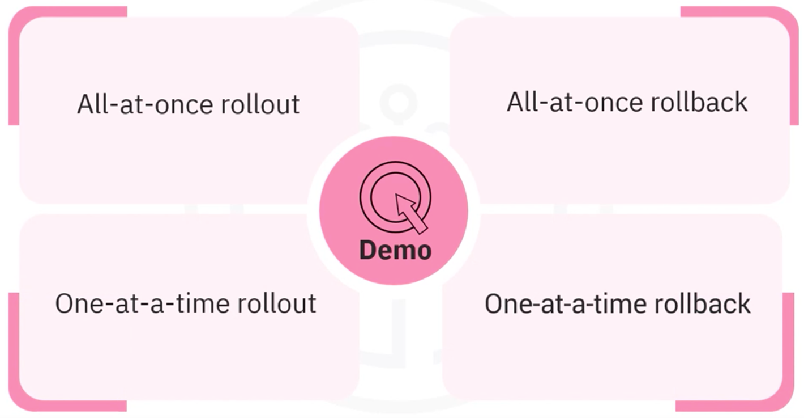
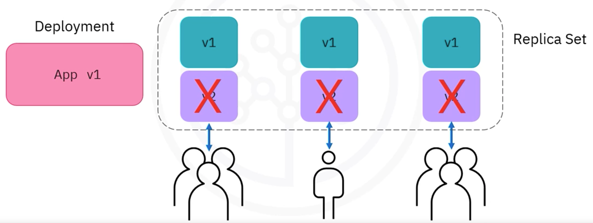
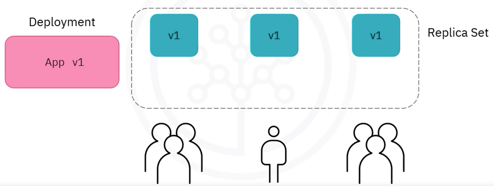
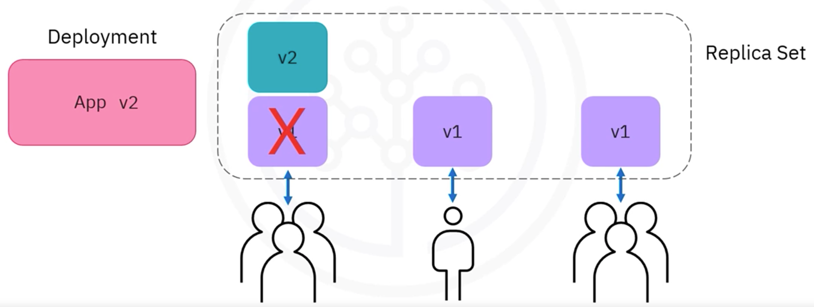
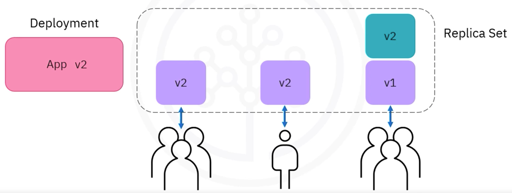
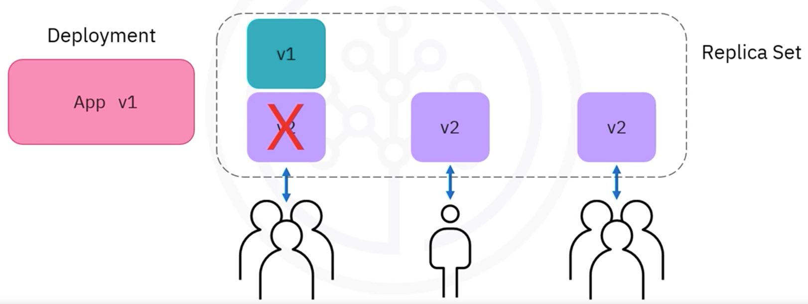
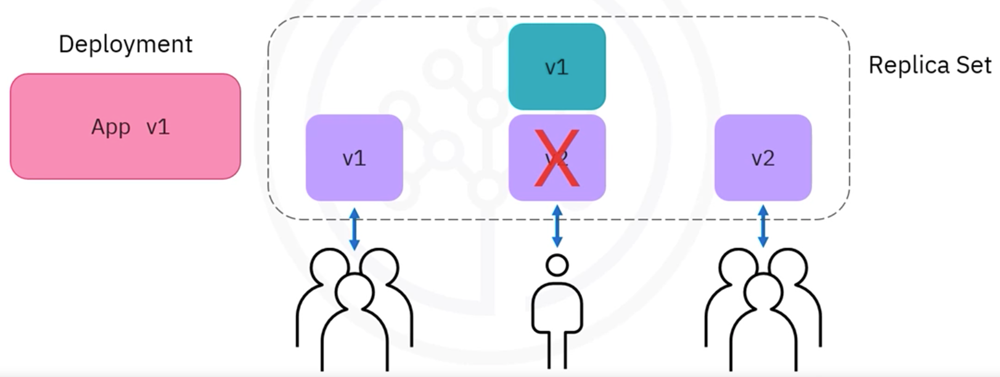
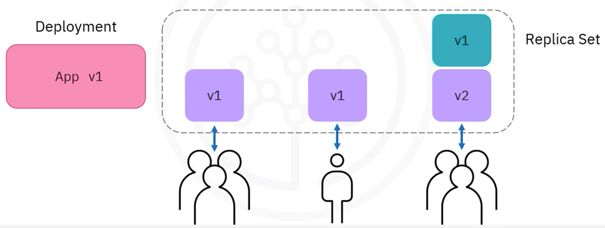

# Module 3 - Section 4: Rolling Updates

## Introduction to Rolling Updates


In this section, we will learn about rolling updates in Kubernetes. After this, you will be able to:
- Explain what a rolling update is and how it works.
- List the pre-steps before a rolling update can be applied.
- Demonstrate how to roll back a rolling update.

## Rolling updates


Rolling updates are automated updates that occur on a scheduled basis. 

- Roll out automated and controlled app changes across pods. 
- Rolling updates work with pod templates like deployments
- Allow for rollback as needed.

## Example of a rolling update 

To prepare the application to enable rolling updates

**Step 1: Add liveness and readiness probes to deployments**


That way deployments are appropriately marked as ready.

**Step 2: Add a rolling update strategy to the YAML file**


In the example:

- Creating a deployment with ten pods: `replicas: 10`
- The strategy is to have at least 50% of the pods always available.
- The `maxSurge: 2` says that there can only be two pods added to the ten you defined earlier. 
- For a zero downtime system, set the `maxUnavailable` to zero.
- Setting the max surge to 100% would double the number of pods and create a complete replica before taking the original set down after the rollout is complete.
- Sometimes it is also useful to use the `minReadySeconds ` attribute to wait a few seconds before moving to the next pod in the rollout stage.

**Current state**

Let's look at a working example of rolling out an application update.

```sh
>> kubectl get pods
NAME                                READY   STATUS    RESTARTS   AGE
hello-kubernetes-55fd6f66c5-wv5tg   1/1     Running   0          5m51s
hello-kubernetes-55fd6f66c5-z6tn7   1/1     Running   0          6m33s
hello-kubernetes-55fd6f66c5-zwwqt   1/1     Running   0          5m51s                                                                                                                                                                                                                                                                           5m51s                                                     0
```



We have a deployment with three pods in the replica set. The application displays the message `hello world`.

**Update versions**

The client has submitted a new request, and you have a new image for the application with a different message instead of the original text. 

You need to show `hello world v2` to the users, but you cannot have any downtime in the application.


**Build, tag, and upload this new image to Docker Hub.**

First, you need to build, tag, and upload this new image to Docker Hub.

```sh
>> docker build -t hello-kubernetes.
Sending build context to Docker daemon  59.39KB
Step 1/11 : FROM node:8.1.0-alpine
8.1.0-alpine: Pulling from library/node
2aecc7e1714b: Pull complete
8c951048fb77: Pull complete
efe91b1aaaa1: Pull complete

>> docker tag hello-kubernetes upkar/hello-kubernetes:2.0

>> docker push upkar/hello-kubernetes:2.0u
```

The new software has been Dockerized and then updated to Docker Hub, with the name and tag `hello-kubernetes upkar/hello-kubernetes:2.0`.

These are simple Docker commands, not related to Kubernetes at all.

**Apply the new image to the deployment**

```sh
>> kubectl get deployments

NAME               READY   UP-TO-DATE   AVAILABLE   AGE
hello-kubernetes   3/3     3            3           21m

>> kubectl set image deployments/hello-kubernetes hello-kubernetes=upkar/hello-kubernetes:2.0
deployment.extensions/hello-kubernetes image updated
```

We have the three pods from the first command. The second command sets the image flag to the updated tag image on Docker Hub.

The output says the image has been updated, but let's verify if that actually happened.

**Version 2 is deployed.**

Observe that version 2 deployment has been rolled out. You can see the status of the rollout by using the `rollout status` command.

```shell
>> kubeclt rollout status deployments/hello-kubernetes

deployment "hello-kubernetes" successfully rolled out
```

Now if we go back to the URL, we will see the new message `hello world v2`.



**Rollback to version 1**

Sometimes there are errors in a deployment, or the client can change their minds. Rollbacks are easy to implement in Kubernetes.

Use an `undo` command on the rollout.

```sh
>> kubectl rollout undo deployments/hello-kubernetes
deployment.extensions/hello-kubernetes rolled back
```

Use the `get pods` command to confirm the rollout pods are terminated.

```sh
>> kubectl get pods
NAME                                READY   STATUS        RESTARTS   AGE
hello-kubernetes-55fd6f66c5-2jv8m   1/1     Running       0          2s
hello-kubernetes-55fd6f66c5-5z5zv   1/1     Running       0          6s
hello-kubernetes-55fd6f66c5-6z5zv   1/1     Running       0          4s
hello-kubernetes-55fd6f66c5-wv5tg   1/1     Terminating   0          24m
hello-kubernetes-55fd6f66c5-z6tn7   0/1     Terminating   0          24m
hello-kubernetes-55fd6f66c5-zwwqt   0/1     Terminating   0          24m
```

You will also see three new pods that are created as part of this rollback.

If we visit the site again, we will see the original message, and that's how we roll back changes to your application.


## Practical demonstration

Let's take a look at how rolling updates work, both all-at-once and one-at-a-time.



### Scenario 1: All-at-once rollout

In an all-at-once rollout, all v1 objects must be removed before v2 objects can become active.

Here you see version 1 of an app with three pods running that users can access.


When version 2 is deployed, new pods are created


The version 1 pods are marked for deletion 


And then removed. User access is blocked.


Once the version 1 pods are removed, the version 2 pods become active, and user access is restored.


Notice the time lag between deployment and pod updates.

### Scenario 2: All-at-once rollback

In an all-at-once rollback, all v2 objects must be removed before v1 objects can become active.

Here we see version 2 of an app with three pods running that users can access.


When version 1 of the app is deployed, new pods are created


The version 2 pods are marked for deletion



And then removed. User access is blocked.



Once the version 2 pods are removed, the version 1 pods become active, and user access is restored.


### Scenario 3: One-at-a-time rollout

In a one-at-a-time rollout, the update is staggered so user access is not interrupted.

Here we see version 1 of an app with three running pods that users can access.


When version 2 is deployed, a new pod is created.


The first version 1 pod is marked for deletion and removed



The v2 pod becomes active.


Then a second v2 pod is created


The second version 1 pod is marked for deletion and removed


The second v2 pod becomes active


The third v2 pod is created



The third version 1 pod is marked for deletion and removed.

And now the third v2 pod becomes active with a staggered update.


With a staggered update, user access is not interrupted.

### Scenario 4: One-at-a-time rollback

In a one-at-a-time rollback, the update rollback is staggered so user access is not interrupted.

Let's see what a one-at-a-time rollback looks like.

Here we see version 2 of an app with three running pods that users can access.


When version 1 of the app is deployed, a new pod is created.


The first version 2 pod is marked for deletion and removed



The v1 pod becomes active


The second v1 pod is created, the second version 2 pod is marked for deletion and removed



The second v1 pod becomes active


The third v1 pod is created, the third version 2 pod is marked for deletion and removed



The third v1 pod becomes active


## Conclusion - Recap

- Rolling updates roll out app changes in a controlled and automated way.
- Rolling updates publish changes to applications without noticeable interruption to end-users.
- Rolling updates can roll back changes when an application needs to revert to a stable state.
- Rolling updates and rollbacks can be performed using all-at-once and one-at-a-time strategies.


WEBVTT

1
00:00:00.000 --> 00:00:07.075
[MUSIC]

2
00:00:07.075 --> 00:00:09.118
Welcome to Rolling Updates.

3
00:00:09.118 --> 00:00:14.269
After watching this video you will be
able explain what a rolling update is and

4
00:00:14.269 --> 00:00:19.183
how it works, list the pre steps before
a rolling update can be applied and

5
00:00:19.183 --> 00:00:22.372
demonstrate how to roll
back a rolling update.

6
00:00:22.372 --> 00:00:26.646
Rolling updates are automated updates
that occur on a scheduled basis.

7
00:00:26.646 --> 00:00:30.468
They roll out automated and
controlled app changes across pods.

8
00:00:30.468 --> 00:00:33.693
Work with pod templates like
deployments and allow for

9
00:00:33.693 --> 00:00:38.193
rollback as needed to prepare your
application to enable rolling updates.

10
00:00:38.193 --> 00:00:41.940
Add liveness probes and
readiness probes to deployments.

11
00:00:41.940 --> 00:00:45.668
That way deployments
are appropriately marked as ready.

12
00:00:45.668 --> 00:00:49.700
Next, add a rolling update
strategy to the YAML file.

13
00:00:49.700 --> 00:00:53.412
In this example, you are creating
a deployment with ten pods.

14
00:00:53.412 --> 00:00:57.448
Your strategy is to have at least
50% of the pods always available.

15
00:00:57.448 --> 00:01:02.310
The max surge of two says that there can
only be two pods added to the ten you

16
00:01:02.310 --> 00:01:03.984
defined earlier.

17
00:01:03.984 --> 00:01:08.420
For a zero downtime system,
set the max unavailable to zero.

18
00:01:08.420 --> 00:01:13.460
Setting the max surge to 100% would double
the number of pods and create a complete

19
00:01:13.460 --> 00:01:18.024
replica before taking the original set
down after the rollout is complete.

20
00:01:18.024 --> 00:01:22.568
And sometimes it is also useful to
use the minReadySeconds attribute

21
00:01:22.568 --> 00:01:27.282
to wait a few seconds before moving
to the next pod in the rollout stage.

22
00:01:27.282 --> 00:01:31.589
Lets look at a working example of
rolling out an application update.

23
00:01:31.589 --> 00:01:35.008
You have a deployment with
three pods in your replica set.

24
00:01:35.008 --> 00:01:38.320
Your application displays
the message hello world.

25
00:01:38.320 --> 00:01:42.084
Your client has submitted a new
request and you have a new image for

26
00:01:42.084 --> 00:01:46.504
your application with a different
message instead of the original text.

27
00:01:46.504 --> 00:01:50.048
You need to show hello world
v two to your users, but

28
00:01:50.048 --> 00:01:53.944
you cannot have any downtime
in your application.

29
00:01:53.944 --> 00:01:59.274
First you need to build, tag and
upload this new image to Docker hub.

30
00:01:59.274 --> 00:02:04.653
Your new software has been Dockerized and
then updated to Docker Hub,

31
00:02:04.653 --> 00:02:10.868
with the name and tag hello-kubernetes
upkar/hello-kubernetes:2.0.

32
00:02:10.868 --> 00:02:15.398
These are simple Docker commands,
not related to Kubernetes at all.

33
00:02:15.398 --> 00:02:18.798
Now apply this new image
to your deployment.

34
00:02:18.798 --> 00:02:21.358
You have the three pods
from the first command.

35
00:02:21.358 --> 00:02:25.950
The second command sets the image flag
to the updated tag image on Docker hub.

36
00:02:25.950 --> 00:02:31.357
The output says the image has been updated
but lets verify if that actually happened.

37
00:02:31.357 --> 00:02:35.523
You can see the status of the rollout
by using the rollout status command.

38
00:02:35.523 --> 00:02:40.365
The API shows deployment
"hello-kubernetes" successfully

39
00:02:40.365 --> 00:02:42.610
rolled out, that's great.

40
00:02:42.610 --> 00:02:48.887
Now if you go back to the URL you will
see the new message hello world B two.

41
00:02:48.887 --> 00:02:54.073
Sometimes there are errors in a deployment
or the client can change their minds.

42
00:02:54.073 --> 00:02:56.909
Rollbacks are easy to
implement in Kubernetes.

43
00:02:56.909 --> 00:02:59.730
Use an undo command on the rollout.

44
00:02:59.730 --> 00:03:04.042
Use the get pods command to confirm
the rollout pods are terminated.

45
00:03:04.042 --> 00:03:08.477
You will also see three new pods that
are created as part of this rollback.

46
00:03:08.477 --> 00:03:11.905
If you visit the site again you
will see the original message and

47
00:03:11.905 --> 00:03:15.150
that's how you roll back
challenges to your application.

48
00:03:15.150 --> 00:03:19.006
Now, let's take a look at
how rolling updates work,

49
00:03:19.006 --> 00:03:22.460
both all-at-once and one-at-a-time.

50
00:03:22.460 --> 00:03:24.355
In an all at once rollout,

51
00:03:24.355 --> 00:03:30.004
all v one objects must be removed
before v two objects can become active.

52
00:03:30.004 --> 00:03:35.492
Here you see version one of an app with
three pods running that users can access.

53
00:03:35.492 --> 00:03:38.707
When version two is deployed,
new pods are created,

54
00:03:38.707 --> 00:03:42.360
the version one pods are marked for
deletion and removed.

55
00:03:42.360 --> 00:03:44.233
User access is blocked.

56
00:03:44.233 --> 00:03:49.167
Once the version 1 pods are removed,
the version 2 pods become active and

57
00:03:49.167 --> 00:03:51.064
user access is restored.

58
00:03:51.064 --> 00:03:55.064
Notice the time lag between deployment and
pod updates.

59
00:03:55.064 --> 00:03:57.152
In an all at once rollback.

60
00:03:57.152 --> 00:04:02.128
All v two objects must be removed
before v one objects can become active.

61
00:04:02.128 --> 00:04:05.188
Lets see what an all at
once rollback looks like.

62
00:04:05.188 --> 00:04:10.804
Here you see version two of an app with
three pods running that users can access.

63
00:04:10.804 --> 00:04:16.017
When version one of the app is deployed,
new pods are created, the version

64
00:04:16.017 --> 00:04:21.095
two pods are marked for deletion and
removed and user access is blocked.

65
00:04:21.095 --> 00:04:25.918
Once the 2 two pods are removed,
the version 1 pods become active and

66
00:04:25.918 --> 00:04:27.730
user access is restored.

67
00:04:27.730 --> 00:04:31.460
In a one-at-a-time rollout,
the update is staggered so

68
00:04:31.460 --> 00:04:34.014
user access is not interrupted.

69
00:04:34.014 --> 00:04:38.957
Here you see version one of an app with
three running pods that users can access.

70
00:04:38.957 --> 00:04:42.598
When version 2 is deployed,
a new pod is created.

71
00:04:42.598 --> 00:04:46.733
The first version one pod is marked for
deletion and removed and

72
00:04:46.733 --> 00:04:48.692
the v two pod becomes active.

73
00:04:48.692 --> 00:04:51.246
Then a second V2 pod is created and

74
00:04:51.246 --> 00:04:56.356
the second version 1 podcast is marked for
deletion and removed.

75
00:04:56.356 --> 00:05:01.212
The second v two pod becomes active,
a third v two pod is created and

76
00:05:01.212 --> 00:05:05.932
the third version one pod is marked for
deletion and removed.

77
00:05:05.932 --> 00:05:11.796
And now the third v two pod becomes
active with a staggered update.

78
00:05:11.796 --> 00:05:15.948
User access is not interrupted
in a one at a time rollback.

79
00:05:15.948 --> 00:05:20.434
The update rollback is staggered so
user access is not interrupted.

80
00:05:20.434 --> 00:05:23.226
Lets see what a one-at-a-time
rollback looks like.

81
00:05:23.226 --> 00:05:28.834
Here you see version two of an app with
three running pods that users can access.

82
00:05:28.834 --> 00:05:33.242
When version one of the app is deployed,
a new pod is created.

83
00:05:33.242 --> 00:05:37.342
The first version two pod is marked for
deletion and removed and

84
00:05:37.342 --> 00:05:39.458
the v one pod becomes active.

85
00:05:39.458 --> 00:05:44.343
Now a second v one pod is created,
the second version two pod is marked for

86
00:05:44.343 --> 00:05:48.630
deletion and removed and
the second v one pod becomes active.

87
00:05:48.630 --> 00:05:53.244
Then a third v one pod is created and
the third version two pod is marked for

88
00:05:53.244 --> 00:05:57.422
deletion and removed, and
the third v one pod becomes active.

89
00:05:57.422 --> 00:06:01.971
In this video, you learn that rolling
updates roll out app changes in

90
00:06:01.971 --> 00:06:04.175
a controlled and automated way.

91
00:06:04.175 --> 00:06:08.179
Rolling updates publish changes to
applications without noticeable

92
00:06:08.179 --> 00:06:09.138
interruption.

93
00:06:09.138 --> 00:06:13.231
Rolling updates can roll back changes
when an application needs to revert.

94
00:06:13.231 --> 00:06:18.148
And rolling updates and rollbacks can
be performed using all-at-once and

95
00:06:18.148 --> 00:06:20.314
one-at-a-time strategies.

96
00:06:20.314 --> 00:06:20.814
[MUSIC]